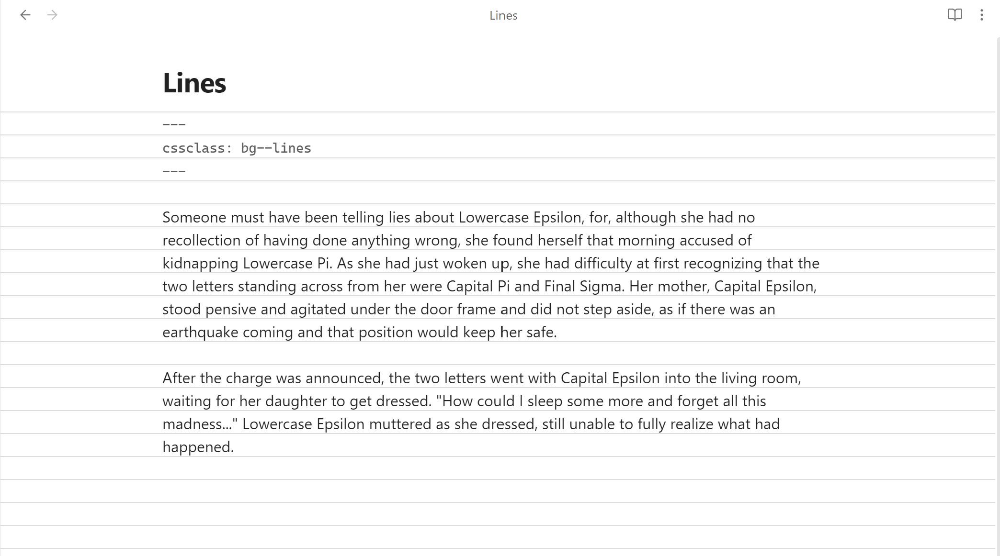

# Plaid Note



*source: [github](https://github.com/gsarig/obsidian-css-snippets)*

- version: 1.0
- author:
  - base: [gsarig](https://github.com/gsarig)
  - color: [xavwe](https://github.com/xavwe)
- source: [github](https://github.com/gsarig/obsidian-css-snippets/blob/main/bg-lines.css)

## Template
```md
---
cssclass: bg--lines
---
# Note Headning
This is some text.

```
